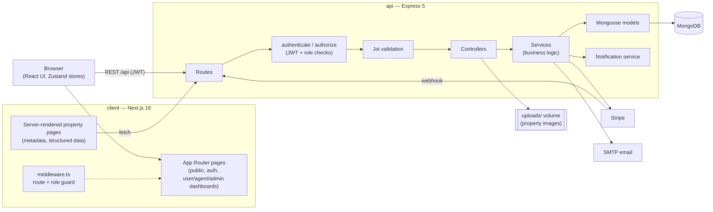
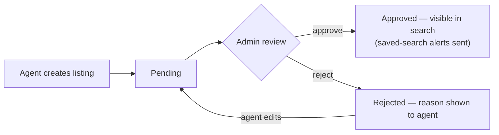

# RealEstate Pro — Sri Lanka Property Marketplace

A full-stack real estate platform for buying, selling and renting property in Sri Lanka.
Buyers can search and compare listings, save favorites, message agents and book
viewings. Agents manage their listings and leads. Admins moderate listings before they go
live.


---

## Table of contents

- [Tech stack](#tech-stack)
- [Features](#features)
- [Screenshots](#screenshots)
- [Architecture](#architecture)
- [Folder structure](#folder-structure)
- [Run with Docker](#run-with-docker-recommended)
- [Demo login credentials](#demo-login-credentials)
- [Run without Docker](#run-without-docker)
- [Environment variables](#environment-variables)
- [Tests](#tests)

---

## Tech stack

| Layer | Technology |
|-------|------------|
| **Frontend** | Next.js 16 (App Router), React 19, TypeScript |
| **Styling / UI** | Tailwind CSS v4, shadcn/ui components on Radix UI primitives, lucide-react icons |
| **State management** | Zustand (auth, favorites, recent views, comparison list) |
| **Forms & validation** | React Hook Form + Zod |
| **Maps** | Leaflet + React Leaflet |
| **HTTP client** | Axios, with automatic access-token refresh |
| **Notifications (UI)** | Sonner toasts |
| **Backend** | Node.js, Express 5, TypeScript |
| **Database** | MongoDB 7 with Mongoose (geospatial `2dsphere` + text indexes) |
| **Auth** | JWT access + refresh tokens (refresh tokens hashed and rotated), bcrypt password hashing, role-based access control |
| **Validation (API)** | Joi |
| **File uploads** | Multer (JPEG/PNG/WebP, 5 MB limit) |
| **Payments** | Stripe Checkout + webhooks |
| **Email** | Nodemailer (SMTP) |
| **Logging / security** | Winston, Morgan, Helmet, CORS |
| **Testing** | Vitest |
| **DevOps** | Docker, Docker Compose |

---

## Features

### Everyone (public)
- **Property search** with filters for location, listing type (buy/rent), property type, price range, bedrooms, bathrooms, area, furnishing, parking and amenities
- **Sorting** by newest, price (low → high / high → low), largest area and most viewed
- **Grid, list and map views** of search results, with pagination
- **Property details page** with an image gallery, key stats, amenities, location map, reviews and agent contact panel
- **Agent directory and agent profile pages** showing each agent's active listings
- **Property comparison** — compare up to 4 properties side by side on price, location, type, size, parking, furnishing and amenities
- **SEO** — per-property page titles, meta descriptions, Open Graph tags and structured data
- **Light / dark theme toggle**

### Buyers (registered users)
- Register, log in, reset password, email verification, edit profile, change password
- **Favorites** — save and remove properties
- **Saved searches** with optional instant alerts when a new matching property is approved
- **Inquiries** — message an agent about a property and view your inquiry history and replies
- **Viewing appointments** — request a date/time, track status, cancel
- **In-app notification center** with unread badge, mark as read / mark all as read
- **Notification preferences**
- Property reviews and reporting of inappropriate listings or reviews

### Agents
- **Create, edit and delete listings** — 8 property types, sale/rent/pending/sold/rented/off-market status, currency, floor and land area, parking, furnishing, amenities, multiple images (the first is the cover), video and virtual-tour links, and an auto-generated property reference number
- **Approval workflow** — new listings start as *pending* and go public only after admin approval; rejected listings show the reason and are resubmitted automatically when edited
- **Leads dashboard** — manage inquiries (new → contacted → closed) and viewing requests (accept, reject, reschedule, complete, cancel) with double-booking prevention
- **Listing performance analytics** — total/active/pending listings, views, favorites, inquiries, scheduled viewings, sold and rented counts
- **Membership plans** (Regular / Business / Premium) with Stripe checkout

### Admins
- **Listing moderation** — approve or reject listings with a reason; the agent is notified either way
- **User management** — activate/deactivate accounts
- **Reports** — review and resolve reported listings, users and reviews
- Platform dashboard summary

### Platform
- **Notifications** generated for new inquiries, inquiry replies, viewing requests and status changes, listing submitted/approved/rejected, and saved-search matches
- **Security** — role checks on every protected API route (not just in the UI), account lockout after repeated failed logins, refresh-token revocation on logout, server-side validation of every write, file-type/size checks on uploads
- **Consistent API errors** and centralized logging

---

## Screenshots

| | |
|---|---|
| **Home page** — hero search by listing type, city and price range | **Add a property** — agents create listings with full property details |
|  |  |
| **Agent directory** — search agents and see their experience and active listings | **Agent profile** — contact details plus every listing by that agent, with favorite and compare buttons |
|  |  |

---

## Architecture

The app is split into a Next.js frontend and a REST API, backed by MongoDB. The browser
talks to the API directly using JWT bearer tokens; the Next.js server also calls the API
when rendering property pages so they arrive fully populated for search engines.



**Backend layering:** each request passes through `route → authenticate/authorize → validation → controller → service → model`.
Controllers handle HTTP concerns, services hold the business rules (ownership checks,
approval workflow, double-booking prevention, notifications), and models define the
MongoDB schemas and indexes. Errors bubble up to a single error handler that returns a
consistent `{ success, message, errors? }` response without leaking stack traces.

**Listing approval flow:**



**Auth flow:** login returns a short-lived access token (15 min) and a refresh token
(7 days). The refresh token is stored hashed in the database and rotated on every
refresh, so logging out revokes it. The Axios client refreshes expired access tokens
automatically.

---

## Folder structure

```
RealStateAllpication/
├── docker-compose.yml          # MongoDB + API + frontend
├── .env.example                # Optional overrides for docker compose
├── README.md
│
├── api/                        # Express + MongoDB backend
│   ├── Dockerfile
│   ├── .env.example
│   └── src/
│       ├── server.ts           # Entry point: DB connection, HTTP server, shutdown
│       ├── app.ts              # Express app: middleware + route mounting
│       ├── config/             # Env validation, DB connection
│       ├── constants/          # Property types/statuses, subscription plans
│       ├── routes/             # URL → controller mapping (+ auth/validation middleware)
│       ├── controllers/        # HTTP layer
│       ├── services/           # Business logic
│       ├── models/             # Mongoose schemas
│       ├── middlewares/        # auth, validation, upload, error handler
│       ├── validations/        # Joi schemas (+ __tests__)
│       ├── interfaces/         # TypeScript types
│       ├── utils/              # Logger, email, Stripe client, errors
│       └── scripts/            # Database seed scripts
│
└── client/                     # Next.js frontend
    ├── Dockerfile
    ├── .env.example
    ├── middleware.ts           # Redirects for protected / role-restricted routes
    ├── app/
    │   ├── page.tsx            # Home
    │   ├── (auth)/             # Login, register, forgot/reset password, verify email
    │   ├── (dashboard)/
    │   │   ├── user/           # Dashboard, listings, favorites, saved searches,
    │   │   │                   # inquiries, appointments, preferences, membership, profile
    │   │   ├── agent/          # Leads, analytics, subscriptions
    │   │   └── admin/          # Listings moderation, users, reports
    │   ├── search/             # Property search (grid / list / map)
    │   ├── properties/         # [id] details page, compare
    │   ├── agent/              # Agent directory and [id] profile
    │   ├── post-ad/            # Create listing
    │   ├── payment/            # Stripe success / cancel
    │   └── about/, contact/
    ├── components/
    │   ├── ui/                 # Design-system primitives (shadcn/ui)
    │   ├── shared/             # Notification bell, compare bar, theme toggle
    │   ├── layouts/            # Navbar, footer, dashboard sidebar
    │   └── features/           # Feature components (home, properties, auth, …)
    ├── lib/
    │   ├── api/                # Typed API clients (Axios)
    │   ├── config/             # Environment config
    │   └── utils/              # Formatting helpers
    ├── stores/                 # Zustand stores (auth, property, compare)
    ├── providers/              # Auth and theme providers
    └── public/                 # Static assets and screenshots
```

---

## Run with Docker (recommended)

This runs the whole stack — database included — with one command. You only need
[Docker Desktop](https://www.docker.com/products/docker-desktop/).

### 1. Start the containers

From the project root:

```bash
docker compose up --build
```

No `.env` file is needed; local defaults are built into `docker-compose.yml`. The first
build takes several minutes. When it's done:

| Service | URL |
|---------|-----|
| Frontend | http://localhost:3000 |
| API | http://localhost:5000/api |
| API health check | http://localhost:5000/health |
| MongoDB | mongodb://localhost:27017 |

### 2. Load the demo data (first run only)

The database starts empty. With the containers running, open a **second terminal** in the
project root and run these two commands, in this order:

```bash
docker compose exec api npm run seed:sl:prod
docker compose exec api npm run seed:demo-profiles:prod
```

The first adds ~60 Sri Lankan listings, agents, reviews and inquiries. The second creates
the demo accounts below and links them to that data. Run the first one only once — it adds
a new batch of listings every time. The second is safe to re-run.

### 3. Log in

Open http://localhost:3000/login and use one of the [demo accounts](#demo-login-credentials).

### Stopping and resetting

```bash
docker compose down        # stop (data is kept)
docker compose up -d       # start again in the background
docker compose down -v     # stop AND delete the database and uploaded images
```

After `down -v`, repeat step 2 to seed again.

### Port 5000 already in use?

If another app already uses port 5000, choose a different host port for the API. The API
address is built into the frontend, so include `--build`:

```bash
API_PORT=5010 docker compose up --build            # macOS / Linux / Git Bash
```
```powershell
$env:API_PORT=5010; docker compose up --build      # Windows PowerShell
```

The API is then at http://localhost:5010. To make it permanent, copy `.env.example` to
`.env` in the project root and set `API_PORT=5010`.

### Optional: payments and email

The app runs fully without these. Only the membership checkout (Stripe) and outgoing
emails (password reset, email verification) need them. Copy the root `.env.example` to
`.env`, fill in your Stripe and SMTP values, then run `docker compose up --build`.

---

## Demo login credentials

Available after [loading the demo data](#2-load-the-demo-data-first-run-only).

| Role | Email | Password | Try this |
|------|-------|----------|----------|
| **Buyer** | `demo.buyer@realestate.lk` | `DemoBuyer@123` | Search, favorites, compare, send an inquiry, request a viewing |
| **Agent** | `demo.user@realestate.lk` | `DemoUser@123` | My listings, post a property, leads & viewings, listing analytics |
| **Admin** | `demo.admin@realestate.lk` | `DemoAdmin@123` | Approve/reject listings, manage users, review reports |

> These are demo accounts for local use only.
>
> Listings posted by the agent start as **pending** — log in as the admin and approve them
> (Admin → Listings) before they appear in public search.

---

## Run without Docker

Requires Node.js 20+ and MongoDB running locally (or a MongoDB Atlas connection string).

```bash
# 1. Backend
cd api
cp .env.example .env        # set MONGODB_URI and JWT_SECRET
npm install
npm run dev                 # http://localhost:5000

# 2. Frontend (second terminal)
cd client
cp .env.example .env.local
npm install
npm run dev                 # http://localhost:3000

# 3. Demo data (third terminal, inside api/)
npm run seed:sl
npm run seed:demo-profiles
```

---

## Environment variables

Full lists are in `api/.env.example` and `client/.env.example`.

| Variable | Where | Required | Purpose |
|----------|-------|----------|---------|
| `MONGODB_URI` | api | Yes | MongoDB connection string |
| `JWT_SECRET` | api | Yes | Token signing secret (at least 32 characters) |
| `FRONTEND_URL` | api | No | Frontend origin for CORS and email links (default `http://localhost:3000`) |
| `SMTP_*`, `FROM_*` | api | No | Outgoing email |
| `STRIPE_SECRET_KEY`, `STRIPE_WEBHOOK_SECRET` | api | No | Membership payments |
| `NEXT_PUBLIC_API_URL` | client | No | API base URL (default `http://localhost:5000/api`) |
| `NEXT_PUBLIC_SITE_URL` | client | No | Public site URL for SEO links (default `http://localhost:3000`) |
| `API_PORT` | root `.env` (Docker) | No | Host port for the API container (default `5000`) |

---

## Tests

```bash
cd api
npm test
```
